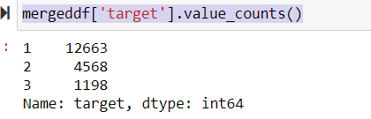
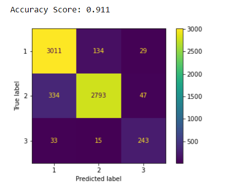

# Anime Classification Capstone
Author: Ilene Sorto

---
## 1.  Business Understanding
Crunchyroll and Funimation just merged their entire catalouges and now have money to burn, they are looking for the top rated anime for their streaming service and what makes the anime's top rated for their own original animes.

----
## 2. Data Understanding
The data im working with for this project comes from this [Kaggle dataset](https://www.kaggle.com/datasets/marlesson/myanimelist-dataset-animes-profiles-reviews) from the year 2020.
The limitations of this dataset are that these ratings can be extremely bias.

---
## 3. EDA and Data cleaning 
The first step was to combine the 3 datasets on the same column to make the master datasets. After that it was time to make the target for the classification from the column score x which is the overall rating of tbe anime. It ranges from one through ten, ten of course being the best rating for the anime. 

1 through 4 being the lowest scores, 5 to 7 being the average rating, and 8 to 10 being the highest rating the anime could get.
--

When making the target column I noticed a class imbalance between the trinary column and had to utilize **SMOTE** 

After that I featured engineered new columns that rate the different aspects of anime like the sound track, animation visual rating, and the character rating.

----
## 4. Modeling
The evaluation metric I choose was accuracy since it was important that the model correctly identified placing the ratings in the right target.

The first model I ran was a dummy classifier the accuracy score for the dummy is not the best at **32%** It correctly identified it. The first official model I ran next was a Logistic Regression which only produced a **49%** accuracy, only going up **17%** but still not as good as it could be.

The last model I ran was a Decision tree classifier which accuracy score out did both previous models by having **91%** accuracy 

I decided to go with the decision tree classifier for performing better

---
# 5. Conclusions 
 Recommendations 
 
 I recommend for crunchyroll:
 - To license popular animes that their competitors don't have the rights to 
- When making their own original animes to focus on the soundtrack 
- To start off with comedy multi labels for the genre for their original animes 

Future Considerations

Next steps for crunchyroll:
- Look into ROI when buying the rights to the animes
- Model NLP for sentiment analysis on twitter 

---